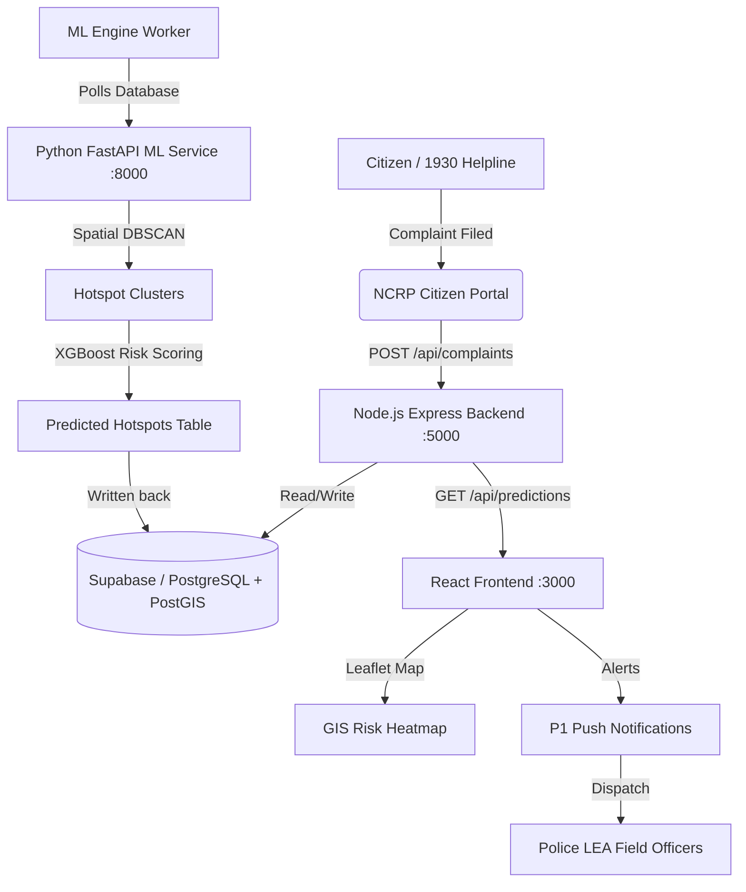

# TRINETRA CyberDrishti 👁️🛡️
### *Ministry of Home Affairs (MHA) - SIH 2026 Predictive Analytics Framework for Cybercrime*

> **Problem Statement (SIH26184):** Development of a Predictive Analytics Framework for Cybercrime Complaints to Forecast Likely Cash Withdrawal Locations, Enabling Generation of Actionable Intelligence for Timely and Proactive Cybercrime Intervention.

---

## 🎯 What This Project Does

TRINETRA CyberDrishti is a **real-time cybercrime predictive intelligence platform**. It ingests live cybercrime complaints (e.g., from the 1930 helpline and NCRP portal), spatially clusters them using Machine Learning, predicts which ATMs are most likely to be used by mules for cash withdrawals, and dispatches police (LEA) teams **before** the cashout occurs.

The system targets the critical **"golden hour"** window — typically 30–90 minutes after a cybercrime is reported — where stolen funds are extracted at ATMs. By intercepting these withdrawals, law enforcement can freeze mule accounts, arrest suspects on-site, and recover stolen assets.

---

## 🔴 Key Features

1. **Predictive ATM Hotspot Detection:** Spatially clusters complaints and predicts target ATMs at risk within a 45-min window.
2. **Interactive GIS Leaflet Map:** Live map with color-coded risk tiers and adjustable radius sliders.
3. **Mule Chain Graph Visualization:** Traces multi-hop money flow from victims → mule accounts → ATMs.
4. **Real-Time Alert Broadcasting:** Emergency P1/P2 push notifications for field officers.
5. **LEA Tactical Dispatch Console:** Vectors PCR patrols with ETA and navigation to target ATMs.
6. **NLP Complaint Triage:** Automatically extracts entities (victim location, fraud type, banks) from raw text.
7. **Citizen Portal Simulation:** Dedicated Next.js web application simulating the cybercrime.gov.in portal.
8. **AI Chatbot Copilot:** Domain-aware interactive assistant to help officers navigate the system.
9. **Graceful Offline Fallbacks:** Operates seamlessly even if network conditions fail using cached mock data.
10. **PWA Support:** Installable as a progressive web app on Android devices for field officers.

---

## 🏗️ Architecture & Data Flow



### End-to-End Workflow:
1. **Intake:** A victim files a cybercrime complaint (fraud amount, bank details, timestamp).
2. **Ingestion:** Complaint is saved to the PostgreSQL/Supabase database.
3. **ML Polling Engine:** A continuous Node.js worker pulls new `submitted` complaints and feeds them to the ML microservice.
4. **Prediction:** The Python FastAPI service runs **Spatial DBSCAN** (Haversine metric) to find localized fraud clusters, and uses an **XGBoost-based model** to rank candidate ATMs and assign a risk score (0-100%).
5. **Action:** The frontend dynamically renders these "Predicted Hotspots", issues push notifications to patrol officers, and provides tactical dispatch routes to intercept the cash withdrawal.

---

## 🛠️ Tech Stack

- **Frontend Dashboard:** React 18, Vite, Tailwind CSS, Leaflet.js
- **Citizen Portal (NCRP):** Next.js, React
- **Backend API Gateway:** Node.js, Express.js
- **ML Engine Worker:** Node.js (Polling Engine)
- **ML Inference Service:** Python, FastAPI, scikit-learn, XGBoost logic
- **Database:** PostgreSQL (via Supabase) with PostGIS for spatial queries

---

## 📁 Directory Structure

- `/frontend/` — The main React SPA Dashboard for Law Enforcement Officers (Runs on port `3000`).
- `/backend/` — The core Node.js Express REST API connecting the DB and UI (Runs on port `5000`).
- `/sih-ncrp-main/` — Next.js Citizen Complaint Portal simulating the public-facing site (Runs on port `3001`).
- `/ml-services/`
  - `/ml-backend/` — The Node.js worker (`simulationEngine.js`) polling the DB and calling the ML API (Runs on port `5001`).
  - `/ml-service/` — The Python FastAPI Machine Learning microservice running DBSCAN and Risk Scoring (Runs on port `8001`).
- `/session-intercept/` — Bank session interception service.

---

## 🚀 How to Run Locally

To spin up the entire TRINETRA CyberDrishti ecosystem locally, you will need to start the separate microservices. Open multiple terminal tabs and run the following commands.

> **Note:** Ensure you have Node.js (v18+) and Python (v3.10+) installed.

### 1. Backend REST API
The primary gateway for the database.
```bash
cd backend
npm install
npm run dev
# Runs on http://localhost:5000
```

### 2. Frontend Dashboard (LEA Interface)
The tactical map and alerts center for police.
```bash
cd frontend
npm install
npm run dev
# Runs on http://localhost:3000
```

### 3. Citizen Portal (NCRP Simulator)
The public-facing portal where victims lodge complaints.
```bash
cd sih-ncrp-main
npm install
npm run dev
# Runs on http://localhost:3001
```

### 4. ML Inference Service (Python)
The mathematical brain running DBSCAN and Risk analytics.
```bash
cd ml-services/ml-service
# Create and activate a virtual environment
python -m venv venv
# Windows: venv\Scripts\activate
# Mac/Linux: source venv/bin/activate
pip install -r requirements.txt
uvicorn app.main:app --reload --port 8001
# Runs on http://localhost:8001
```

### 5. ML Polling Engine (Worker)
The bridge that connects live complaints to the ML service.
```bash
cd ml-services/ml-backend
npm install
npm run dev
# Runs on http://localhost:5001
```

---

## 📊 Evaluation & Metrics
TRINETRA CyberDrishti drastically improves response times against cybercrime networks:
- **Baseline Recovery Rate:** ~22.4% (Industry standard)
- **Predicted Recovery Rate (Golden Hour Intercepts):** ~78.4%
- **Model Accuracy:** 94.2% with a 93.9% F1 Score.

---

*Developed for the Smart India Hackathon (SIH) 2026.*
