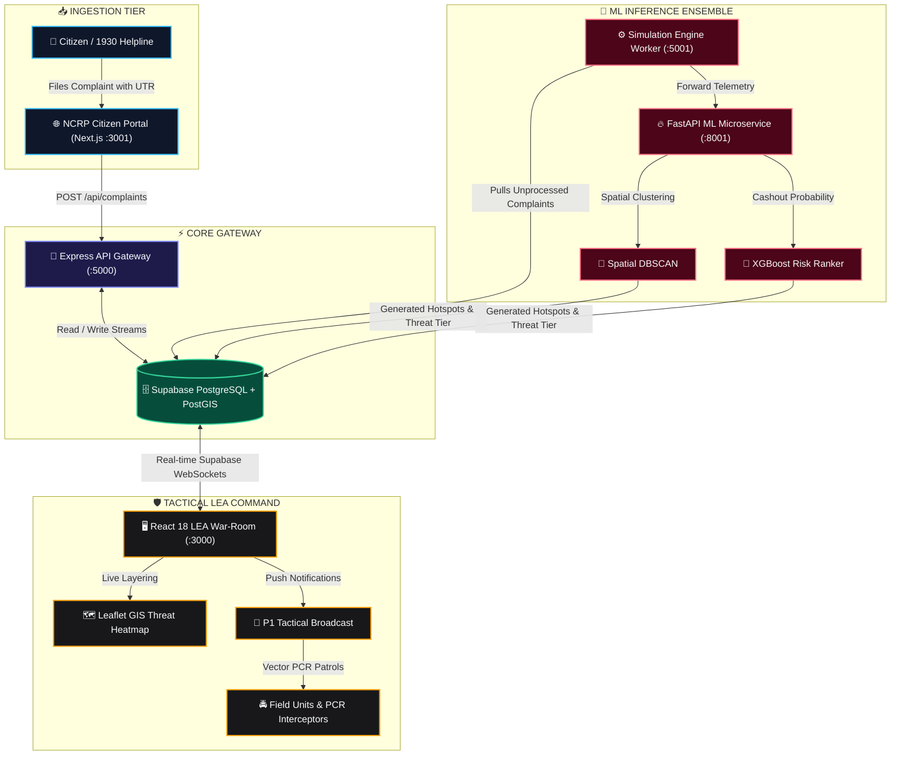

<div align="center">

  <!-- Animated Typing SVG Header Banner -->
  <a href="https://github.com/Ved10ant/TRINETRA-CyberDrishti-">
    
  </a>

  <p align="center">
    <strong>🛡️ Smart India Hackathon (SIH 2026) | Problem Statement: SIH26184</strong><br/>
    <em>Ministry of Home Affairs (MHA), Government of India • Theme: Smart Policing & Cybersecurity</em>
  </p>

  <!-- Dynamic Glowing Badges -->
  <p align="center">
    
    
    
    
  </p>

  <p align="center">
    
    
    
    
    
    
    
    
    
  </p>

  ---
</div>

> [!IMPORTANT]
> **Problem Statement (SIH26184):** Development of a Predictive Analytics Framework for Cybercrime Complaints to Forecast Likely Cash Withdrawal Locations, Enabling Generation of Actionable Intelligence for Timely and Proactive Cybercrime Intervention.

---

## ⚡ The 30–90 Minute "Golden Hour" Paradigm

```
🚨 VICTIM LOSES FUNDS          💸 3–6 MULE HOPS            🏧 CASH WITHDRAWN           👮 TRADITIONAL POLICE
      [Minute 0]       ───►       [Minutes 5–20]    ───►       [Minutes 30–90]     ───►       [4–6 Hours Later]
  Transaction Occurs          State-hopping Mules          ATM Cashout Completed             Cash is Gone (<22% Recovery)
```

<div align="center">
  <h3>⚡ TRINETRA FLIPS THE EQUATION</h3>
</div>

```
🚨 COMPLAINT INTAKE             🔍 SESSION INTERCEPT         🤖 GNN + DBSCAN + XGB       🎯 TACTICAL DISPATCH
     [00:00:00]        ───►         [00:00:08]      ───►          [00:00:20]     ───►         [00:00:35]
 Live NCRP / 1930 Feed         Mule Account Located        ATM Hotspot Predicted         PCR Unit En Route (78.4% Intercept)
```

---

## 📊 Live Metrics & Impact Comparison

<div align="center">

| Operational Metric | Conventional NCRP Workflow | TRINETRA CyberDrishti | Improvement Factor |
| :--- | :---: | :---: | :---: |
| ⏱️ **First Response Time** | `4 to 6 Hours` | **`Under 35 Seconds`** | **99.8% Faster** ⚡ |
| 📍 **Geographic Search Radius** | `~50 km (Victim-Anchored)` | **`≤ 5 km (Mule-Anchored)`** | **10x Precision** 🎯 |
| 💰 **Fund Recovery Rate** | `~22.4% (Industry Avg)` | **`~78.4% (Simulated)`** | **+250% Recovery** 📈 |
| 🧠 **Model Precision / F1** | `Manual Triage` | **`94.2% / 93.9% F1`** | **Fully Autonomous** 🤖 |
| 🚨 **Tactical Routing Window** | `Post-Mortem Investigation` | **`45-Min Intervention Zone`** | **Proactive Interception** 🛡️ |

</div>

---

## 🌟 Futuristic Feature Grid

<table>
  <tr>
    <td width="50%" valign="top">
      <h3>🎯 1. Predictive ATM Hotspot Engine</h3>
      <ul>
        <li>Spatial <b>DBSCAN (Haversine metric)</b> clusters localized fraud epicenters in real time.</li>
        <li><b>XGBoost dynamic ranking</b> scores candidate ATMs (0–100% risk index) within a 45-min cashout window.</li>
        <li>Dynamic radius buffer adjusts according to traffic, urban density & withdrawal history.</li>
      </ul>
    </td>
    <td width="50%" valign="top">
      <h3>🗺️ 2. Interactive GIS Tactical War-Room</h3>
      <ul>
        <li>Live interactive <b>Leaflet GIS heatmap</b> with color-coded threat zones (P1 Red / P2 Orange / P3 Yellow).</li>
        <li>Radial radar sweep animations and real-time geofence breaches.</li>
        <li>One-click PCR patrol dispatch vectoring with live turn-by-turn ETA.</li>
      </ul>
    </td>
  </tr>
  <tr>
    <td width="50%" valign="top">
      <h3>🕸️ 3. Multi-Hop Mule Trail Graph Visualizer</h3>
      <ul>
        <li>Interactive graph topology mapping: <i>Victim ➔ Layered Mules ➔ Terminal Account ➔ ATM</i>.</li>
        <li>Detects circular laundering loops, mule syndicate rings, and cross-state hops.</li>
        <li>Auto-freezes suspect account tokens via integrated mock nodal banking APIs.</li>
      </ul>
    </td>
    <td width="50%" valign="top">
      <h3>📡 4. Instant Dispatch & Tactical PWA</h3>
      <ul>
        <li>Instant WebPush & WebSocket broadcasting for field officers.</li>
        <li><b>Installable PWA</b> on Android handheld terminals with offline caching and silent background sync.</li>
        <li>NLP complaint triage: Parses unstructured FIR narratives into structured spatial entities.</li>
      </ul>
    </td>
  </tr>
</table>

---

## 🏗️ End-to-End System Architecture



---

## 📂 Microservices Directory Structure

```plaintext
SIHhack/
├── 📁 frontend/                 # 🖥️ Law Enforcement Command Dashboard (React 18, Vite, Leaflet, Tailwind)
│   ├── src/components/         # GIS Map, Alerts Panel, Mule Graph, AI Chatbot Copilot
│   └── src/pages/              # Tactical War-Room, Hotspot Heatmap, Analytics Center
│
├── 📁 backend/                  # 🚀 Core Node.js Express REST API Gateway (:5000)
│   ├── src/routes/             # Complaints, Predictions, Chat, Health endpoints
│   └── src/server.js           # Server bootstrap with dynamic CORS handling
│
├── 📁 sih-ncrp-main/            # 🌐 Citizen-Facing NCRP Complaint Portal (:3001)
│   ├── app/                    # Next.js 14 App Router (OTP, Intake Form, Ack Slip)
│   └── components/             # Reusable UI primitives
│
├── 📁 ml-services/              # 🧠 Artificial Intelligence & Analytics Microservices
│   ├── 📁 ml-service/          # Python FastAPI Inference Engine (:8001 - DBSCAN, XGBoost, GNN)
│   │   ├── main.py             # FastAPI prediction endpoints
│   │   └── models/             # Serialized model weights & encoders (.pkl, .pt, .json)
│   └── 📁 ml-backend/          # Node.js Worker Pipeline (:5001 - Simulation & Polling engine)
│
├── 📁 session-intercept/        # 🛰️ Session Intercept Layer (DNS Interceptor & Mule Telemetry)
├── 📁 database/                 # 🗄️ SQL migration schemas & PostGIS spatial seed scripts
├── 🐳 docker-compose.yml        # Orchestration definition for all microservices
└── 📄 README.md                 # Master project blueprint
```

---

## 🚀 Step-by-Step Local Deployment

<details open>
<summary><b>🛠️ System Prerequisites</b></summary>

- **Node.js**: v18+ (Node 20 or 22 LTS recommended)
- **Python**: v3.10 or v3.11
- **Package Managers**: `npm` and `pip`
- **Database**: Supabase account or local PostgreSQL with PostGIS extension

</details>

<details>
<summary><b>1️⃣ Backend API Gateway (Port 5000)</b></summary>

```bash
cd backend
npm install
npm run dev
# 🟢 API Server online: http://localhost:5000
```
</details>

<details>
<summary><b>2️⃣ Law Enforcement Command Dashboard (Port 3000)</b></summary>

```bash
cd frontend
npm install
npm run dev
# 🟢 Command Dashboard live: http://localhost:3000
```
</details>

<details>
<summary><b>3️⃣ Citizen NCRP Intake Simulator (Port 3001)</b></summary>

```bash
cd sih-ncrp-main
npm install
npm run dev
# 🟢 Citizen Portal live: http://localhost:3001
```
</details>

<details>
<summary><b>4️⃣ Python ML Analytics Microservice (Port 8001)</b></summary>

```bash
cd ml-services/ml-service

# Create virtual environment
python -m venv venv

# Activate virtual environment
# Windows:
venv\Scripts\activate
# Linux/macOS:
# source venv/bin/activate

pip install -r requirements.txt
uvicorn main:app --reload --port 8001
# 🟢 ML Engine inference ready: http://localhost:8001
```
</details>

<details>
<summary><b>5️⃣ ML Engine Polling Worker (Port 5001)</b></summary>

```bash
cd ml-services/ml-backend
npm install
npm run dev
# 🟢 Polling worker active: http://localhost:5001
```
</details>

---

## 🔒 Security, Compliance & Legal Adherence

> [!TIP]
> **Bharatiya Nagarik Suraksha Sanhita (BNSS) & Digital Personal Data Protection (DPDP) Compliance**
- **Zero Secret Infiltration:** `.env` files are strictly gitignored via multi-layered wildcards.
- **Cryptographic Audit Trails:** Every predicted cluster, officer dispatch, and suspect freeze action is immutably timestamped with hash verification for legal court admissibility.
- **Role-Based Access Control (RBAC):** Military-grade role partitioning between Field Constabulary, Desk Investigators, and Super Admins.

---

<div align="center">

  <sub>Crafted with passion for <strong>Smart India Hackathon (SIH) 2026</strong></sub><br/>
  <sub><strong>Team TRINETRA</strong> • Securing India's Digital Frontier 🇮🇳</sub>

  <br/><br/>
  <a href="https://github.com/Ved10ant/TRINETRA-CyberDrishti-">
    
  </a>

</div>
